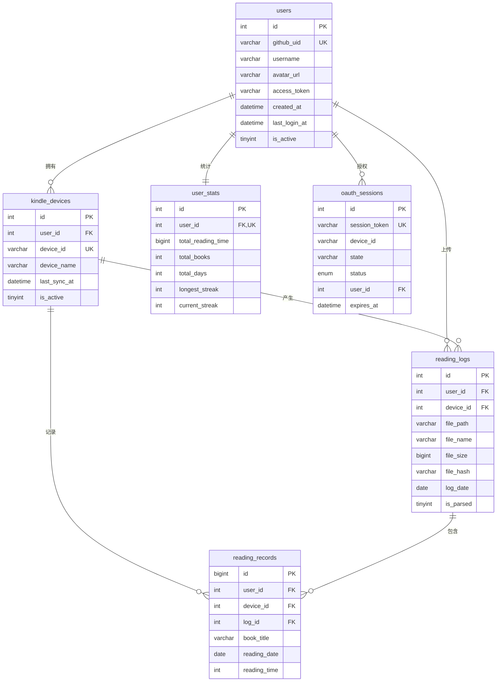

# Kindle Reading GTK 云同步服务端 - 数据库设计

## 概述

本文档定义了 Kindle Reading GTK 云同步服务端的 MySQL 数据库结构设计。

## 数据库配置

- **数据库名**: `kindle_reading`
- **字符集**: `utf8mb4`
- **排序规则**: `utf8mb4_unicode_ci`
- **存储引擎**: InnoDB

## 数据表结构

### 1. users 表 - GitHub 用户信息

存储通过 GitHub OAuth 登录的用户信息。

| 字段名 | 类型 | 约束 | 说明 |
|--------|------|------|------|
| id | INT UNSIGNED | PRIMARY KEY, AUTO_INCREMENT | 用户 ID（自增主键） |
| github_uid | VARCHAR(50) | NOT NULL, UNIQUE | GitHub 用户 ID |
| username | VARCHAR(100) | NOT NULL | GitHub 用户名 |
| avatar_url | VARCHAR(500) | NULL | GitHub 头像 URL |
| access_token | VARCHAR(255) | NOT NULL | GitHub OAuth Access Token |
| refresh_token | VARCHAR(255) | NULL | GitHub OAuth Refresh Token |
| token_expires_at | DATETIME | NULL | Token 过期时间 |
| created_at | DATETIME | NOT NULL, DEFAULT CURRENT_TIMESTAMP | 创建时间 |
| updated_at | DATETIME | NOT NULL, DEFAULT CURRENT_TIMESTAMP ON UPDATE | 更新时间 |
| last_login_at | DATETIME | NULL | 最后登录时间 |
| is_active | TINYINT(1) | NOT NULL, DEFAULT 1 | 是否激活（1=激活，0=禁用） |

**索引**:
- PRIMARY KEY: `id`
- UNIQUE: `github_uid`
- INDEX: `username`, `created_at`, `last_login_at`

---

### 2. kindle_devices 表 - Kindle 设备信息

存储用户绑定的 Kindle 设备信息。

| 字段名 | 类型 | 约束 | 说明 |
|--------|------|------|------|
| id | INT UNSIGNED | PRIMARY KEY, AUTO_INCREMENT | 设备 ID（自增主键） |
| user_id | INT UNSIGNED | NOT NULL, FOREIGN KEY | 关联用户 ID |
| device_id | VARCHAR(100) | NOT NULL, UNIQUE | Kindle 设备唯一标识 |
| device_name | VARCHAR(200) | NULL | 设备名称（用户自定义） |
| device_type | VARCHAR(50) | NULL | 设备型号 |
| firmware_version | VARCHAR(50) | NULL | 固件版本 |
| last_sync_at | DATETIME | NULL | 最后同步时间 |
| created_at | DATETIME | NOT NULL, DEFAULT CURRENT_TIMESTAMP | 绑定时间 |
| updated_at | DATETIME | NOT NULL, DEFAULT CURRENT_TIMESTAMP ON UPDATE | 更新时间 |
| is_active | TINYINT(1) | NOT NULL, DEFAULT 1 | 是否激活（1=激活，0=禁用） |

**索引**:
- PRIMARY KEY: `id`
- UNIQUE: `device_id`
- INDEX: `user_id`, `last_sync_at`
- FOREIGN KEY: `user_id` → `users(id)` ON DELETE CASCADE

---

### 3. reading_logs 表 - 阅读日志文件

存储上传的阅读日志文件信息。

| 字段名 | 类型 | 约束 | 说明 |
|--------|------|------|------|
| id | INT UNSIGNED | PRIMARY KEY, AUTO_INCREMENT | 日志 ID（自增主键） |
| user_id | INT UNSIGNED | NOT NULL, FOREIGN KEY | 关联用户 ID |
| device_id | INT UNSIGNED | NOT NULL, FOREIGN KEY | 关联设备 ID |
| file_path | VARCHAR(500) | NOT NULL | 文件存储路径 |
| file_name | VARCHAR(255) | NOT NULL | 原始文件名 |
| file_size | BIGINT UNSIGNED | NOT NULL | 文件大小（字节） |
| file_hash | VARCHAR(64) | NOT NULL | 文件 SHA256 哈希值 |
| log_date | DATE | NOT NULL | 日志日期 |
| upload_at | DATETIME | NOT NULL, DEFAULT CURRENT_TIMESTAMP | 上传时间 |
| parsed_at | DATETIME | NULL | 解析完成时间 |
| is_parsed | TINYINT(1) | NOT NULL, DEFAULT 0 | 是否已解析（1=已解析，0=未解析） |

**索引**:
- PRIMARY KEY: `id`
- INDEX: `user_id`, `device_id`, `log_date`, `file_hash`, `upload_at`
- FOREIGN KEY: `user_id` → `users(id)` ON DELETE CASCADE
- FOREIGN KEY: `device_id` → `kindle_devices(id)` ON DELETE CASCADE

---

### 4. reading_records 表 - 阅读记录

存储解析后的阅读记录数据。

| 字段名 | 类型 | 约束 | 说明 |
|--------|------|------|------|
| id | BIGINT UNSIGNED | PRIMARY KEY, AUTO_INCREMENT | 记录 ID（自增主键） |
| user_id | INT UNSIGNED | NOT NULL, FOREIGN KEY | 关联用户 ID |
| device_id | INT UNSIGNED | NOT NULL, FOREIGN KEY | 关联设备 ID |
| log_id | INT UNSIGNED | NOT NULL, FOREIGN KEY | 关联日志 ID |
| book_title | VARCHAR(500) | NULL | 书名 |
| book_author | VARCHAR(200) | NULL | 作者 |
| reading_date | DATE | NOT NULL | 阅读日期 |
| reading_time | INT UNSIGNED | NOT NULL | 阅读时长（秒） |
| reading_start_time | DATETIME | NULL | 阅读开始时间 |
| reading_end_time | DATETIME | NULL | 阅读结束时间 |
| page_count | INT UNSIGNED | NULL | 阅读页数 |
| created_at | DATETIME | NOT NULL, DEFAULT CURRENT_TIMESTAMP | 记录创建时间 |

**索引**:
- PRIMARY KEY: `id`
- INDEX: `user_id`, `device_id`, `log_id`, `reading_date`, `book_title(255)`, `user_date(user_id, reading_date)`
- FOREIGN KEY: `user_id` → `users(id)` ON DELETE CASCADE
- FOREIGN KEY: `device_id` → `kindle_devices(id)` ON DELETE CASCADE
- FOREIGN KEY: `log_id` → `reading_logs(id)` ON DELETE CASCADE

---

### 5. user_stats 表 - 用户统计

存储用户的阅读统计数据（用于排行榜）。

| 字段名 | 类型 | 约束 | 说明 |
|--------|------|------|------|
| id | INT UNSIGNED | PRIMARY KEY, AUTO_INCREMENT | 统计 ID（自增主键） |
| user_id | INT UNSIGNED | NOT NULL, UNIQUE, FOREIGN KEY | 关联用户 ID |
| total_reading_time | BIGINT UNSIGNED | NOT NULL, DEFAULT 0 | 总阅读时长（秒） |
| total_books | INT UNSIGNED | NOT NULL, DEFAULT 0 | 阅读书籍总数 |
| total_days | INT UNSIGNED | NOT NULL, DEFAULT 0 | 阅读天数 |
| longest_streak | INT UNSIGNED | NOT NULL, DEFAULT 0 | 最长连续阅读天数 |
| current_streak | INT UNSIGNED | NOT NULL, DEFAULT 0 | 当前连续阅读天数 |
| last_reading_date | DATE | NULL | 最后阅读日期 |
| last_updated | DATETIME | NOT NULL, DEFAULT CURRENT_TIMESTAMP ON UPDATE | 最后更新时间 |

**索引**:
- PRIMARY KEY: `id`
- UNIQUE: `user_id`
- INDEX: `total_reading_time`, `total_days`, `longest_streak`
- FOREIGN KEY: `user_id` → `users(id)` ON DELETE CASCADE

---

### 6. oauth_sessions 表 - OAuth 会话

存储 OAuth 登录会话信息（用于轮询机制）。

| 字段名 | 类型 | 约束 | 说明 |
|--------|------|------|------|
| id | INT UNSIGNED | PRIMARY KEY, AUTO_INCREMENT | 会话 ID（自增主键） |
| session_token | VARCHAR(64) | NOT NULL, UNIQUE | 会话令牌（UUID） |
| device_id | VARCHAR(100) | NOT NULL | Kindle 设备 ID |
| state | VARCHAR(64) | NOT NULL | OAuth state 参数 |
| status | ENUM | NOT NULL, DEFAULT 'pending' | 会话状态：pending/authorized/completed/expired |
| user_id | INT UNSIGNED | NULL, FOREIGN KEY | 授权后关联的用户 ID |
| created_at | DATETIME | NOT NULL, DEFAULT CURRENT_TIMESTAMP | 创建时间 |
| expires_at | DATETIME | NOT NULL | 过期时间 |
| completed_at | DATETIME | NULL | 完成时间 |

**索引**:
- PRIMARY KEY: `id`
- UNIQUE: `session_token`
- INDEX: `device_id`, `state`, `status`, `expires_at`
- FOREIGN KEY: `user_id` → `users(id)` ON DELETE SET NULL

---

### 7. system_config 表 - 系统配置

存储系统配置参数。

| 字段名 | 类型 | 约束 | 说明 |
|--------|------|------|------|
| id | INT UNSIGNED | PRIMARY KEY, AUTO_INCREMENT | 配置 ID（自增主键） |
| config_key | VARCHAR(100) | NOT NULL, UNIQUE | 配置键 |
| config_value | TEXT | NULL | 配置值 |
| description | VARCHAR(500) | NULL | 配置说明 |
| created_at | DATETIME | NOT NULL, DEFAULT CURRENT_TIMESTAMP | 创建时间 |
| updated_at | DATETIME | NOT NULL, DEFAULT CURRENT_TIMESTAMP ON UPDATE | 更新时间 |

**索引**:
- PRIMARY KEY: `id`
- UNIQUE: `config_key`

**默认配置**:
| config_key | config_value | description |
|------------|--------------|-------------|
| max_file_size | 104857600 | 最大上传文件大小（字节），默认 100MB |
| allowed_file_extensions | json,gz,txt,log | 允许上传的文件扩展名 |
| session_timeout | 300 | OAuth 会话超时时间（秒），默认 5 分钟 |
| data_retention_days | 365 | 数据保留天数，默认 1 年 |
| enable_registration | 1 | 是否允许新用户注册（1=允许，0=禁止） |

---

## 完整 SQL 建表语句

```sql
-- Kindle Reading GTK 云同步服务端数据库结构
-- 字符集: utf8mb4
-- 排序规则: utf8mb4_unicode_ci

-- 创建数据库（如果不存在）
CREATE DATABASE IF NOT EXISTS kindle_reading CHARACTER SET utf8mb4 COLLATE utf8mb4_unicode_ci;

USE kindle_reading;

-- ============================================
-- 用户表 (users)
-- ============================================
CREATE TABLE IF NOT EXISTS users (
    id INT UNSIGNED AUTO_INCREMENT PRIMARY KEY COMMENT '用户 ID（自增主键）',
    github_uid VARCHAR(50) NOT NULL UNIQUE COMMENT 'GitHub 用户 ID',
    username VARCHAR(100) NOT NULL COMMENT 'GitHub 用户名',
    avatar_url VARCHAR(500) DEFAULT NULL COMMENT 'GitHub 头像 URL',
    access_token VARCHAR(255) NOT NULL COMMENT 'GitHub OAuth Access Token',
    refresh_token VARCHAR(255) DEFAULT NULL COMMENT 'GitHub OAuth Refresh Token',
    token_expires_at DATETIME DEFAULT NULL COMMENT 'Token 过期时间',
    created_at DATETIME NOT NULL DEFAULT CURRENT_TIMESTAMP COMMENT '创建时间',
    updated_at DATETIME NOT NULL DEFAULT CURRENT_TIMESTAMP ON UPDATE CURRENT_TIMESTAMP COMMENT '更新时间',
    last_login_at DATETIME DEFAULT NULL COMMENT '最后登录时间',
    is_active TINYINT(1) NOT NULL DEFAULT 1 COMMENT '是否激活（1=激活，0=禁用）',
    
    INDEX idx_github_uid (github_uid),
    INDEX idx_username (username),
    INDEX idx_created_at (created_at),
    INDEX idx_last_login_at (last_login_at)
) ENGINE=InnoDB DEFAULT CHARSET=utf8mb4 COLLATE=utf8mb4_unicode_ci COMMENT='GitHub 用户信息表';

-- ============================================
-- Kindle 设备表 (kindle_devices)
-- ============================================
CREATE TABLE IF NOT EXISTS kindle_devices (
    id INT UNSIGNED AUTO_INCREMENT PRIMARY KEY COMMENT '设备 ID（自增主键）',
    user_id INT UNSIGNED NOT NULL COMMENT '关联用户 ID',
    device_id VARCHAR(100) NOT NULL UNIQUE COMMENT 'Kindle 设备唯一标识',
    device_name VARCHAR(200) DEFAULT NULL COMMENT '设备名称（用户自定义）',
    device_type VARCHAR(50) DEFAULT NULL COMMENT '设备型号',
    firmware_version VARCHAR(50) DEFAULT NULL COMMENT '固件版本',
    last_sync_at DATETIME DEFAULT NULL COMMENT '最后同步时间',
    created_at DATETIME NOT NULL DEFAULT CURRENT_TIMESTAMP COMMENT '绑定时间',
    updated_at DATETIME NOT NULL DEFAULT CURRENT_TIMESTAMP ON UPDATE CURRENT_TIMESTAMP COMMENT '更新时间',
    is_active TINYINT(1) NOT NULL DEFAULT 1 COMMENT '是否激活（1=激活，0=禁用）',
    
    INDEX idx_user_id (user_id),
    INDEX idx_device_id (device_id),
    INDEX idx_last_sync_at (last_sync_at),
    FOREIGN KEY (user_id) REFERENCES users(id) ON DELETE CASCADE
) ENGINE=InnoDB DEFAULT CHARSET=utf8mb4 COLLATE=utf8mb4_unicode_ci COMMENT='Kindle 设备信息表';

-- ============================================
-- 阅读日志文件表 (reading_logs)
-- ============================================
CREATE TABLE IF NOT EXISTS reading_logs (
    id INT UNSIGNED AUTO_INCREMENT PRIMARY KEY COMMENT '日志 ID（自增主键）',
    user_id INT UNSIGNED NOT NULL COMMENT '关联用户 ID',
    device_id INT UNSIGNED NOT NULL COMMENT '关联设备 ID',
    file_path VARCHAR(500) NOT NULL COMMENT '文件存储路径',
    file_name VARCHAR(255) NOT NULL COMMENT '原始文件名',
    file_size BIGINT UNSIGNED NOT NULL COMMENT '文件大小（字节）',
    file_hash VARCHAR(64) NOT NULL COMMENT '文件 SHA256 哈希值',
    log_date DATE NOT NULL COMMENT '日志日期',
    upload_at DATETIME NOT NULL DEFAULT CURRENT_TIMESTAMP COMMENT '上传时间',
    parsed_at DATETIME DEFAULT NULL COMMENT '解析完成时间',
    is_parsed TINYINT(1) NOT NULL DEFAULT 0 COMMENT '是否已解析（1=已解析，0=未解析）',
    
    INDEX idx_user_id (user_id),
    INDEX idx_device_id (device_id),
    INDEX idx_log_date (log_date),
    INDEX idx_file_hash (file_hash),
    INDEX idx_upload_at (upload_at),
    FOREIGN KEY (user_id) REFERENCES users(id) ON DELETE CASCADE,
    FOREIGN KEY (device_id) REFERENCES kindle_devices(id) ON DELETE CASCADE
) ENGINE=InnoDB DEFAULT CHARSET=utf8mb4 COLLATE=utf8mb4_unicode_ci COMMENT='阅读日志文件表';

-- ============================================
-- 阅读记录表 (reading_records)
-- ============================================
CREATE TABLE IF NOT EXISTS reading_records (
    id BIGINT UNSIGNED AUTO_INCREMENT PRIMARY KEY COMMENT '记录 ID（自增主键）',
    user_id INT UNSIGNED NOT NULL COMMENT '关联用户 ID',
    device_id INT UNSIGNED NOT NULL COMMENT '关联设备 ID',
    log_id INT UNSIGNED NOT NULL COMMENT '关联日志 ID',
    book_title VARCHAR(500) DEFAULT NULL COMMENT '书名',
    book_author VARCHAR(200) DEFAULT NULL COMMENT '作者',
    reading_date DATE NOT NULL COMMENT '阅读日期',
    reading_time INT UNSIGNED NOT NULL COMMENT '阅读时长（秒）',
    reading_start_time DATETIME DEFAULT NULL COMMENT '阅读开始时间',
    reading_end_time DATETIME DEFAULT NULL COMMENT '阅读结束时间',
    page_count INT UNSIGNED DEFAULT NULL COMMENT '阅读页数',
    created_at DATETIME NOT NULL DEFAULT CURRENT_TIMESTAMP COMMENT '记录创建时间',
    
    INDEX idx_user_id (user_id),
    INDEX idx_device_id (device_id),
    INDEX idx_log_id (log_id),
    INDEX idx_reading_date (reading_date),
    INDEX idx_book_title (book_title(255)),
    INDEX idx_user_date (user_id, reading_date),
    FOREIGN KEY (user_id) REFERENCES users(id) ON DELETE CASCADE,
    FOREIGN KEY (device_id) REFERENCES kindle_devices(id) ON DELETE CASCADE,
    FOREIGN KEY (log_id) REFERENCES reading_logs(id) ON DELETE CASCADE
) ENGINE=InnoDB DEFAULT CHARSET=utf8mb4 COLLATE=utf8mb4_unicode_ci COMMENT='阅读记录表';

-- ============================================
-- 用户统计表 (user_stats)
-- ============================================
CREATE TABLE IF NOT EXISTS user_stats (
    id INT UNSIGNED AUTO_INCREMENT PRIMARY KEY COMMENT '统计 ID（自增主键）',
    user_id INT UNSIGNED NOT NULL UNIQUE COMMENT '关联用户 ID',
    total_reading_time BIGINT UNSIGNED NOT NULL DEFAULT 0 COMMENT '总阅读时长（秒）',
    total_books INT UNSIGNED NOT NULL DEFAULT 0 COMMENT '阅读书籍总数',
    total_days INT UNSIGNED NOT NULL DEFAULT 0 COMMENT '阅读天数',
    longest_streak INT UNSIGNED NOT NULL DEFAULT 0 COMMENT '最长连续阅读天数',
    current_streak INT UNSIGNED NOT NULL DEFAULT 0 COMMENT '当前连续阅读天数',
    last_reading_date DATE DEFAULT NULL COMMENT '最后阅读日期',
    last_updated DATETIME NOT NULL DEFAULT CURRENT_TIMESTAMP ON UPDATE CURRENT_TIMESTAMP COMMENT '最后更新时间',
    
    INDEX idx_user_id (user_id),
    INDEX idx_total_reading_time (total_reading_time),
    INDEX idx_total_days (total_days),
    INDEX idx_longest_streak (longest_streak),
    FOREIGN KEY (user_id) REFERENCES users(id) ON DELETE CASCADE
) ENGINE=InnoDB DEFAULT CHARSET=utf8mb4 COLLATE=utf8mb4_unicode_ci COMMENT='用户阅读统计表';

-- ============================================
-- OAuth 会话表 (oauth_sessions)
-- ============================================
CREATE TABLE IF NOT EXISTS oauth_sessions (
    id INT UNSIGNED AUTO_INCREMENT PRIMARY KEY COMMENT '会话 ID（自增主键）',
    session_token VARCHAR(64) NOT NULL UNIQUE COMMENT '会话令牌（UUID）',
    device_id VARCHAR(100) NOT NULL COMMENT 'Kindle 设备 ID',
    state VARCHAR(64) NOT NULL COMMENT 'OAuth state 参数',
    status ENUM('pending', 'authorized', 'completed', 'expired') NOT NULL DEFAULT 'pending' COMMENT '会话状态',
    user_id INT UNSIGNED DEFAULT NULL COMMENT '授权后关联的用户 ID',
    created_at DATETIME NOT NULL DEFAULT CURRENT_TIMESTAMP COMMENT '创建时间',
    expires_at DATETIME NOT NULL COMMENT '过期时间',
    completed_at DATETIME DEFAULT NULL COMMENT '完成时间',
    
    INDEX idx_session_token (session_token),
    INDEX idx_device_id (device_id),
    INDEX idx_state (state),
    INDEX idx_status (status),
    INDEX idx_expires_at (expires_at),
    FOREIGN KEY (user_id) REFERENCES users(id) ON DELETE SET NULL
) ENGINE=InnoDB DEFAULT CHARSET=utf8mb4 COLLATE=utf8mb4_unicode_ci COMMENT='OAuth 会话表';

-- ============================================
-- 系统配置表 (system_config)
-- ============================================
CREATE TABLE IF NOT EXISTS system_config (
    id INT UNSIGNED AUTO_INCREMENT PRIMARY KEY COMMENT '配置 ID（自增主键）',
    config_key VARCHAR(100) NOT NULL UNIQUE COMMENT '配置键',
    config_value TEXT COMMENT '配置值',
    description VARCHAR(500) DEFAULT NULL COMMENT '配置说明',
    created_at DATETIME NOT NULL DEFAULT CURRENT_TIMESTAMP COMMENT '创建时间',
    updated_at DATETIME NOT NULL DEFAULT CURRENT_TIMESTAMP ON UPDATE CURRENT_TIMESTAMP COMMENT '更新时间',
    
    INDEX idx_config_key (config_key)
) ENGINE=InnoDB DEFAULT CHARSET=utf8mb4 COLLATE=utf8mb4_unicode_ci COMMENT='系统配置表';

-- ============================================
-- 插入默认系统配置
-- ============================================
INSERT INTO system_config (config_key, config_value, description) VALUES
('max_file_size', '104857600', '最大上传文件大小（字节），默认 100MB'),
('allowed_file_extensions', 'json,gz,txt,log', '允许上传的文件扩展名'),
('session_timeout', '300', 'OAuth 会话超时时间（秒），默认 5 分钟'),
('data_retention_days', '365', '数据保留天数，默认 1 年'),
('enable_registration', '1', '是否允许新用户注册（1=允许，0=禁止）')
ON DUPLICATE KEY UPDATE config_value = VALUES(config_value);
```

## 数据库关系图



## 安全考虑

1. **SQL 注入防护**: 所有数据库操作必须使用 PDO 预处理语句
2. **文件上传安全**: 
   - 验证文件扩展名
   - 计算并存储文件 SHA256 哈希值
   - 限制文件大小
   - 将上传文件存储在 Web 根目录之外
3. **Token 安全**: 
   - Access Token 加密存储
   - 定期刷新 Token
   - 设置合理的过期时间
4. **数据隔离**: 按用户 ID 隔离所有数据，确保用户只能访问自己的数据

## 性能优化

1. **索引策略**: 为常用查询字段添加索引
2. **分区策略**: 考虑对 `reading_records` 表按日期分区
3. **数据归档**: 定期归档历史数据，保持主表性能
4. **缓存策略**: 对频繁访问的统计数据使用缓存